# **MiniSQL设计说明书**

##### 浙江大学2018~2019学年春夏学期《数据库系统》夏学期大程报告

## 1 总体框架

#### 1.1 实现功能分析

##### 1.1.1 总目标：

- 设计并实现一个精简型单用户*SQL*引擎 ***(DBMS)*** ***MiniSQL***，允许用户通过字符界面输入*SQL*语句实现表的建立/删除；索引的建立/删除以及表记录的插入/删除/查找。

##### 1.1.2 需求概述

- **数据类型：** 只要求支持三种基本数据类型：`int`，`char(n)`，`float`，其中`char(n)`满足 $1 ≤n ≤ 255$。
- **表定义：** 一个表最多可以定义$32$个属性，各属性可以指定是否为`unique`；支持单属性的主键定义。
- **索引的建立和删除：** 对于表的主属性自动建立`B+`树索引，对于声明为`unique`的属性可以通过SQL语句由用户指定建立/删除`B+`树索引（因此，所有的`B+`树索引都是单属性单值的）。
- **查找记录：** 可以通过指定用`and`连接的多个条件进行查询，支持等值查询和区间查询。
- **插入和删除记录：** 支持每次一条记录的插入操作；支持每次一条或多条记录的删除操作。

#### 1.2 系统体系结构

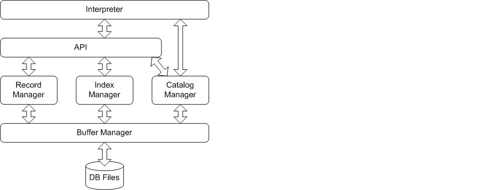

#### 1.3 设计语言与运行环境

**工具：JAVA JDK 10.0.2**

**集成开发环境：Win10 IntelliJ IDEA**


## 2 各模块实现功能

#### 2.1 *Interpreter*

`Interpreter`模块直接与用户交互，主要实现以下功能：

- 程序流程控制，即启动并初始化→【接收命令、处理命令、显示命令结果】循环→退出流程。

- 接收并解释用户输入的命令，生成命令的内部数据结构表示，同时检查命令的语法正确性和语义正确性，对正确的命令调用API层提供的函数执行并显示执行结果，对不正确的命令显示错误信息。


#### 2.2 *API*

`API`模块是整个系统的核心，其主要功能为提供执行SQL语句的接口，供`Interpreter`层调用。该接口以`Interpreter`层解释生成的命令内部表示为输入，根据`Catalog Manager`提供的信息确定执行规则，并调用`Record Manager`、`Index Manager`和`Catalog Manager`提供的相应接口进行执行，最后返回执行结果给`Interpreter`模块。

#### 2.3 *Catalog Manager*

`Catalog Manager`负责管理数据库的所有模式信息，包括：

- 数据库中所有表的定义信息，包括表的名称、表中字段（列）数、主键、定义在该表上的索引。

- 表中每个字段的定义信息，包括字段类型、是否唯一等。

- 数据库中所有索引的定义，包括所属表、索引建立在那个字段上等。


`Catalog Manager`还必需提供访问及操作上述信息的接口，供`Interpreter`和`API`模块使用。

#### 2.4 *Record Manager*

`Record Manager`负责管理记录表中数据的数据文件。主要功能为实现数据文件的创建与删除（由表的定义与删除引起）、记录的插入、删除与查找操作，并对外提供相应的接口。其中记录的查找操作要求能够支持不带条件的查找和带一个条件的查找（包括等值查找、不等值查找和区间查找）。

数据文件由一个或多个数据块组成，块大小应与缓冲区块大小相同。一个块中包含一条至多条记录，为简单起见，只要求支持定长记录的存储，且不要求支持记录的跨块存储。

#### 2.5 *Index Manager*

`Index Manager`负责`B+`树索引的实现，实现`B+`树的创建和删除（由索引的定义与删除引起）、等值查找、插入键值、删除键值等操作，并对外提供相应的接口。

`B+`树中节点大小应与缓冲区的块大小相同，`B+`树的叉数由节点大小与索引键大小计算得到。

#### 2.6 *Buffer Manager*

`Buffer Manager`负责缓冲区的管理，主要功能有：

- 根据需要，读取指定的数据到系统缓冲区或将缓冲区中的数据写出到文件

- 实现缓冲区的替换算法，当缓冲区满时选择合适的页进行替换

- 记录缓冲区中各页的状态，如是否被修改过等

- 提供缓冲区页的*pin*功能，及锁定缓冲区的页，不允许替换出去

为提高磁盘I/O操作的效率，缓冲区与文件系统交互的单位是块，块的大小应为文件系统与磁盘交互单位的整数倍，一般可定为4KB或8KB。

#### 2.7 *DB Files*

`DB Files`指构成数据库的所有数据文件，主要由记录数据文件、索引数据文件和`Catalog`数据文件组成。


## 3 内部数据形式及各模块提供的接口

#### 3.1 内部数据存放形式

##### 3.1.1 异常处理

在底层模块中，遇到异常时，会抛出Java系统自带的异常类，如`IllegalArgumentException, NullPointerException`等，但这不便于统一输出错误信息，因此，我们自定义了`QException`异常类，`API`模块在`catch`到底层模块的异常后，统一抛出`QException`，并在`Interpreter`中进行错误信息的输出。

`QException`类定义如下：

```java
public class QException extends Exception {
    public int status; //status code
    public int type; //exception type: 0 for 'syntax error' and 1 for 'rn time error'
    public String msg; //exception message
    public static final String[] ex = {"Syntax error ", "Run time error "};
}
```

`status`表示自定义的错误状态码，`type`表示错误类型，分为语法错误与运行时错误，对应`ex`中的两个字符串，而`msg`则为具体的错误信息。错误状态码如下：

###### Syntax Error

| 状态码 | 错误信息                                                    | 状态码 | 错误信息                                                   |
| ------ | ----------------------------------------------------------- | ------ | ---------------------------------------------------------- |
| 200    | No statement specified                                      | 602    | Extra parameters in drop table                             |
| 201    | Can't find create object                                    | 701    | Not specify index name                                     |
| 202    | Can't identify ... (create时的名称)                         | 702    | Must add keyword 'on' after index name ...                 |
| 203    | Can't find drop object ...                                  | 703    | Not specify table name                                     |
| 204    | Can't identify ... (drop时的名称)                           | 704    | Not specify attribute name in table ...                    |
| 205    | Can't identify ... (指令)                                   | 705    | Error in specify attribute name ...                        |
| 323    | Can not find valid key word after 'show'!                   | 706    | Extra parameters in create index                           |
| 401    | Must specify a table name                                   | 801    | Not specify index name                                     |
| 402    | Can't find attribute definition                             | 802    | Extra parameters in drop index                             |
| 403    | Can't not find the definition brackets in table ...         | 250    | Can not find key word 'from' or lack of blank before from! |
| 404    | Empty attribute in table ...                                | 901    | Must add keyword 'into' after insert                       |
| 405    | Error definition of primary key in table ...                | 902    | Not specify the table name                                 |
| 406    | Error definition of primary key in table ...                | 903    | Must add keyword 'into' after insert                       |
| 407    | Redefinition of primary key in table ...                    | 904    | Not specify the insert value                               |
| 408    | Incomplete definition in attribute ...                      | 905    | Syntax error: Not specify the insert value                 |
| 409    | Redefinition in attribute                                   | 906    | Must add keyword 'values' after table ...                  |
| 410    | ust specify char length in ...                              | 907    | Can't not find the insert brackets in table ...            |
| 411    | Wrong definition of char length in ...                      | 908    | Empty attribute value in insert value                      |
| 412    | The char length in ... dosen't match a int type or overflow | 1001   | Extra parameters in quit                                   |
| 413    | The char length in ... must be in [1,255]                   | 1101   | Extra parameters in sql file execution                     |
| 414    | Error attribute type ... in ...                             | 1103   | Can't find the file                                        |
| 415    | Error constraint definition in ...                          | 1104   | IO exception occurs                                        |
| 416    | Not specified primary key in table ...                      |        |                                                            |
| 601    | Not specify table name                                      |        |                                                            |

###### Runtime Error

| 状态码 | 错误信息                                | 状态码 | 错误信息                           |
| ------ | --------------------------------------- | ------ | ---------------------------------- |
| 500    | Failed to initialize API!               | 512    | `IllegalArgumentException`错误信息 |
| 501    | Table ... already exist!                | 513    | Failed to delete on table ...      |
| 502    | Failed to create an index on table ...  | 514    | Table ... doesn't exist!           |
| 503    | Failed to create table ...              | 515    | `IllegalArgumentException`错误信息 |
| 504    | Table ... doesn't exist!                | 516    | Table ... doesn't exist!           |
| 505    | Failed to drop table ...                | 517    | `IllegalArgumentException`错误信息 |
| 506    | Failed to create index ... on table ... | 518    | Failed to select from table ...    |
| 507    | Failed to drop index ... on table ...   | 519    | Table ... doesn't exist!           |
| 508    | Table ... doesn't exist!                | 520    | `IllegalArgumentException`错误信息 |
| 509    | `IllegalArgumentException`错误信息      | 521    | Table ... doesn't exist!           |
| 510    | Failed to insert a row on table ...     | 522    | `IllegalArgumentException`错误信息 |
| 511    | Table ... doesn't exist!                | 909    | Attribute number doesn't match     |
| 707    | Not a unique attribute                  | 910    | Duplicate unique key: ...          |

有些不同状态码的错误信息是一样的 ，这是由于在不同的过程 (insert, delete, select , create, drop 等) 中遇到相同的问题而抛出的不同的状态码。

##### 3.1.2 *CatalogManager*数据

存储在`table_catalog`和`index_catalog`两个二进制文件中，在创建出catalog实例的时候即解析这两个文件并载入内存中由于。这两个文件使用频繁并且占用内存并不大，所以由`CatalogManager`单独保管，而不交给`BufferManager`管理。

##### 3.1.3 *BufferManager*, *Block*数据结构

`BufferManager`缓冲区主要由`Block`类以及一系列的成员方法进行管理。为了提高I/O效率，每一个`Block`由4096字节组成，同时，缓冲区中最多能够放置50个`Block`，其数据结构如下：

```java
public static final int BLOCKSIZE = 4096;  //4KB for 1 block
private byte[] blockData = new byte[BLOCKSIZE];  //allocate 4KB memory for 1 block

private static final int MAXBLOCKNUM = 50;  //maximum block numbers
public static Block[] buffer = new Block[MAXBLOCKNUM];  //buffer
```


#### 3.2 *Interpreter* 实现
***Interperter*总体流程： ** `Interpreter`模块直接与用户交互，负责接收并解释用户输入的命令，返回结果信息，实现程序总体流程控制，其总体设计流程如下:

1. **语句读入**：采用`BufferReader`类作为输入流，`StringBuilder`类作为命令语句存储空间。首先循环从输入流中读入一行字符，添加到存储空间中，直到该行字符串存在`;`字符，表明结束，此时进行字符串截取，保留`;`之前的字符串作为当前处理命令，`;`之后的字符串作为下一条命令的开始。每次进行读取时，需要先判断上一次剩余的字符串是否存在`;`，决定是否再次进行截取。

2. **正则替换**: 得到当前处理命令语句后，进行正则替换，将头尾的空白字符去除，将语句内的多个空白字符替换成一个空格，得到正则替换后的命令语句。

3. **初步解析**：将正则替换后的命令语句进行分割，调用`String`类的`split`函数对空格进行分割，得到一个`token`数组。对`token`数组中的关键字进行初步判断，如`create`、`delete`等，若关键字对应，则跳转至该关键字的处理流程中，进行二级解析。若没有对应的关键字，则抛出异常。

4. **二级解析**：初步解析后，根据关键字跳转至相应的解析函数中，内部进行最终解析，根据相应的命令语句调用`API`模块函数完成交互，显示结果，或根据语法错误抛出异常。共有`create table`，`create index`，`drop table`，`drop index`，`show`，`insert`，`select`，`delete`，`exefile`，`quit`这几类子处理流程，将在下一部分详细介绍。

5. **异常处理**：所有异常在子处理流程中抛出，在总处理流程中捕获，显示异常对应的状态吗，异常类型和异常信息。

6. **循环流程**：处理完一条命令后，重新循环处理下一条命令。直到手动退出，此时关闭输入流并结束程序。此外，若输入流到达末尾 (文件读入)，则关闭输入流并进行程序返回。

**二级解析流程实现介绍**:
* `create table`：首先进行正则替换，将`()`和`,`的分割转化为统一形式。接着跳过`create table`关键字，读取表名，然后将属性定义两边的`()`去掉，获得中间属性。得到整个的属性定义字符串后，调用`String`的`split`函数对`,`进行分割，分别得到每个属性的定义。对于每个属性，再次调用`String`的`split`函数对空格进行分割，得到属性名、类型、长度、唯一约束，主键定义等信息。将所有读取的属性信息构造成一个 `Table`类变量，再根据之前读取的表名，调用`API`中的`create_table`函数完成表的创建。此外，流程会对语法错误进行判断，并抛出相应的异常。

* `create index`：首先进行正则替换，将`()`的分割转化为统一形式。接着跳过`create index`关键字，读取索引名、然后跳过`on`关键字，读取表名，将属性名两边的`()`去掉，读取属性名。根据读入的索引名、表名、属性名信息，构造一个`Index`类变量，然后调用`API`中的`create_index`函数完成索引的创建。此外，流程会对语法错误进行判断，并抛出相应的异常。

* `drop table`：首先跳过`drop table`关键字，读取表名，然后根据表名调用`API`中的`drop_table`函数完成对表的删除。此外，流程会对语法错误进行判断，并抛出相应的异常。

* `drop index`：首先跳过`drop index`关键字，读取索引名，然后根据索引名调用`API`中的`drop_index`函数完成对索引的删除。此外，流程会对语法错误进行判断，并抛出相应的异常。

* `show`：首先跳过`show`关键字，然后根据下一个词是`indexes`还是`tables`来决定显示索引还是数据表，如果关键词不是这两者则报错。

* `insert`：首先进行正则替换，将`()`和`,`的分割转化为统一形式。接着跳过`insert into`关键字，读取表名，然后跳过`values`关键字，将属性值两边的`()`去掉，提取中间的属性值。得到整个属性值定义字符串后，调用`String`类中`split`函数对`,`进行分割，得到每个属性的值。对于每个属性值，判断其两端是否有`''`或`""`，若有则将其去除，将全部得到属性值构造成一个`TableRow`类型的变量，调用`API`中`insert_row`函数对记录进行插入。此外，流程会对语法错误进行判断，并抛出相应的异常。

* `select`：`select`语句主要有以下几种形式`select * from [表名];`，`select * from [表名] where [条件];` `select [属性名] from [表名];` 以及 `select [属性名] from [表名] where [条件];`。我们通过自定义函数`String substring(String stmt, String start, String end)`来得到位于两个字符串之间的子串，以最复杂的`select [属性名] from [表名] where [条件];`为例，先通过`substring(stmt,"select ", " from")`来得到属性名或`*`，如果是属性名则通过`split`函数根据`,`进行分割。同理通过`substring ( stmt,"from ", " where")`可以得到表名，通过`substring (stmt,"wuere ", "")`可以得到条件。然后只需根据具体情况判断即可。

* `delete`：`delete`的处理方式与`select`类似。

* `exefile`：首先跳过`exefile`关键字，读取文件名。然后根据文件名构造一个`BufferReader`类的输入流变量，以此为参数递归调用总体解析流程。此外，流程会对对语法错误进行判断，并抛出相应的异常。对于文件不存在等错误，也抛出相应异常。

* `quit`：首先关闭`BufferReader`输入流，然后调用`System.out.exit`退出程序。此外，流程会对语法错误进行判断，并抛出相应的异常。

#### 3.3 *CatalogManager* 接口

***CatalogManager*设计思想：**`CatalogManager`负责管理数据库的所有模式信息，主要是表的所有信息以及表中字段上所有的索引信息，其总体设计思想如下:

* **哈希存储**： 采用`LinkedHashMap`这一数据结构存储所有的表和索引信息。作为哈希表，插入的`Table`和`Index`不允许重复，新的则插入在有空闲的地方。该数据结构同时拥有链表的特性，可以在读取哈希表中所有数据时保持插入时的顺序输出。
* **抽象类型**： 将`Table`、`Index`、`Attribute`等模式信息全部各自封装为一个完整的类，可以访问其public部分的模式信息和public的函数。`Table`作为整个模块的核心，它的类中封装有所有相关的`Index`和`Attribute`。
* **信息传递**：`CatalogManager`模块没有依赖于其他模块而存在，与之相对的，`CatalogManager`提供了大量的接口供`BufferManager`以外的所有模块使用。`CatalogManager`实现虽然难度不大，却是整个项目的核心之一所在。
* **文件读写**：生成`table_catalog`和`index_catalog`两个文件，分别保存`Table`和`Index` 的所有模式信息。

***CatalogManager* 主要函数实现：**

* **初始化**：从`table_catalog`和`index_catalog`两个文件中读取所有模式信息并插入到两个哈希表中。
* **存储**：程序关闭时将哈希表中所有模式信息写回到两个文件中。
* **打印**：`show_table()`和`show_index()`两个函数负责打印出所有表的信息和索引信息。打印时的分隔符可随打印的字符串的长度而改变。
* **读取信息**：大量的`get_xx（）`接口帮助其他模块在仅知道表名/索引名等有限的信息时查询到其他有关联的信息。
* **插入**：插入表时直接插入到哈希表，插入索引时需要在哈希表和索引对应的那张表中写入索引信息。
* **删除**：删除表时直接从哈希表中删除。删除索引时需要在哈希表和索引对应的那张表中都删除索引信息。

`CatalogManager`对外提供以下接口：

```java
//初始化Catalog，读取table_catalog和index_catalog中所有模式信息
+ public static void initial_catalog() throws IOException;

//将内存中所有信息的写入文件
+ public static void store_catalog() throws IOException；

//打印内存中table和index的信息
+ public static void show_catalog()；

//打印内存中table的信息
+ public static void show_table()；

//打印内存中index的信息
+ public static void show_index()；

 //通过表名获得Table类对象的信息
+ public static Table get_table(String tableName)；
+ public static Index get_index(String indexName)；
+ public static String get_primary_key(String tableName)；
+ public static int get_row_length(String tableName)；
+ public static int get_attribute_num(String tableName)；
+ public static int get_row_num(String tableName)；

//字段的判断函数，是则返回true
+ public static boolean is_primary_key(String tableName, String attributeName)；
+ public static boolean is_unique(String tableName, String attributeName)；
+ public static boolean is_index_key(String tableName, String attributeName)；

//获得某个index或attribute的信息
+ public static String get_index_name(String tableName, String attributeName)；
+ public static String get_attribute_name(String tableName, int i)；
+ public static int get_attribute_index(String tableName, String attributeName)；
+ public static FieldType get_attribute_type(String tableName, String attributeName)；

//获得attribute的length和type
+ public static int get_length(String tableName, String attributeName)；
+ public static String get_type(String tableName, int i)；
+ public static int get_length(String tableName, int i)；

//tuple行数的修改
+ public static void add_row_num(String tableName)；
+ public static void delete_row_num(String tableName, int num)；

//更换index
+ public static boolean update_index_table(String indexName, Index tmpIndex)；

//检查attributeVector中是否有特定attribute
+ public static boolean is_attribute_exist(Vector<Attribute> attributeVector, String attributeName)；

//***常用接口*****

//建立表，建立失败则抛出异常
+ public static boolean create_table(Table newTable) throws NullPointerException；

//删除表，删除失败则抛出异常
+ public static boolean drop_table(String tableName) throws NullPointerException；

//建立索引，建立失败则抛出异常
+ public static boolean create_index(Index newIndex) throws NullPointerException；

//删除索引，删除失败则抛出异常
+ public static boolean drop_index(String indexName) throws NullPointerException；
```

#### 3.4 *RecordManager* 接口

***RecodManager* 设计思想：** `RecordManager`负责管理记录表中数据的数据文件，实现最终对文件内记录的增查删改操作，其总体设计思想如下：

- **单表存储**：一个文件存一张表，一张表上的所有记录全部存在一个文件内

- **文件结构**：采用堆文件结构，记录在有空闲的地方均可插入，无须再对记录顺序进行额外处理。

- **空闲链表**：为保证利用充分的存储空间，文件会维护一个空闲链表，将空闲的记录区域进行记录。在文件的`第1个Block`的`前4Bytes`保存第一个空闲记录所在的地址 (一个地址对应一条记录，从0开始编址)，对于指向的空闲记录，它会保存下一个空闲记录所在的地址，形成一个空闲链表。插入时可以根据空闲链表对应的地址进行记录的插入，充分利用空闲空间。注：若空闲地址为`-1`，表明此为空闲链表的尾部，若继续插入，则需要插入到所有记录的尾部。

- **记录存储**：记录在块之间连续存储，若块剩余空间不足，则在新的块中存储，记录不会跨块存储。每条记录开头额外存储`1Byte`的标志字节，用于标志该条记录是否有效，后面存储记录对应的属性值。若该条记录是存在的，标志字节置为`-1`，后面存储对应的属性值；若该条记录是空的，标志字节置为`0`，后面的属性空间存储一个`4Bytes`大小的地址，用于表示下一个空闲记录所在的地址，达到存储空间重用。注: 若记录属性值本身不足`4Bytes`，则将其扩充到`4Bytes`，保证表中所有记录所占空间是固定的。

- **文件读写**：使用`BufferManager`对文件块进行读写，使用缓存技术减小文件`I/O`操作。

***RecordManager* 主要函数实现：**

- **建表**：使用`File`类的`createNewFile`函数创建一个与表名相同的文件，读入文件的第一个快，将`前4Bytes`的存储空间写入`-1`，表明此为空闲链表的尾部。

- **删表**：调用`BufferManager`函数将该文件所有在缓冲区的块置为无效，调用`File`类的`delete`函数将文件删除。

- **查找**：对于对应表名的文件，从文件头开始顺序扫描记录，跳过首字节为`0`的空记录，读取存在记录对应的属性，判断是否符合条件，若符合则将其加入结果中，查找完毕返回结果。

- **插入**：对于对应表名的文件，首先读取其第一个块，读取`前4Bytes`的空闲链表地址，若为`-1`，则调用`CatalogManager`获取记录个数，找到全部记录尾部对应的地址，若为非负数，则直接定位第一个空闲记录地址。找到地址后，在首字节写入`-1`，在后续空间写入记录对应的属性值，同时更新文件第一个块`前4Bytes`的空闲记录地址。

- **删除**：对于对应表名的文件，首先读取其第一个块并给其上锁。顺序扫描记录，跳过首字节为`0`的空记录，读取存在记录对应的属性，若符合删除条件则将其标志字节置为`0`，然后将接下来`4Bytes`的空间写入文件头的空闲地址值，用于指示下一个空闲记录地址，最后更新文件头`前4Bytes`的空闲地址，使其指向当前的删除记录所在的地址，完成空闲链表的更新。

- **地址查找/删除**：对于存在索引的表，通过`IndexManager`可以找到记录所在的地址，因此`RecordManager`提供直接通过地址来对记录查找/删除的方法。与普通查找/删除方法类似，不同之处在于定位方式不再是顺序扫描，而是根据地址对应的值逐个定位，其余操作与普通查找/删除方法类似。为尽量减小不同块的访问次数,首先会对全部地址从低到高排序，使在同一块内的记录可以统一处理。

- **记录保存**：通过调用`BufferManager`的`destruct_buffer_manager`函数清空缓冲区，将缓冲区内的块写回硬盘中，实现记录的保存。

`RecordManager`对外提供如下接口：

```java
//创建给定表名的表（新建文件）
//若创建成功返回true，创建失败返回false
+ public static boolean create_table(String tableName)；

//删除给定表名的表 (删除文件）
//若删除成功返回true，删除失败返回false
+ public static boolean drop_table(String tableName)；

//select功能函数，给定表名和条件，返回符合该条件的全部记录
//返回记录的属性顺序和创建表时一致
+ public static Vector<TableRow> select(String tableName, Vector<Condition> conditions)；

//insert功能函数，给定表名和待插入记录，返回该记录所插入的地址
//插入记录中属性顺序必须和创建表时属性的顺序一致
//若插入失败，返回null
+ public static Address insert(String tableName, TableRow data)；

//delete功能函数，给定表名和条件，删除表中符合条件的记录，返回删除记录的个数
+ public static int delete(String tableName, Vector<Condition> conditions)；

//select功能函数，给定一系列地址及条件，返回对应地址、且符合条件的全部记录
//返回记录的属性顺序和创建表时一致
//所有地址必须在同一文件内
//若地址对应的记录不存在，则不会加入结果中
+ public static Vector<TableRow> select(Vector<Address> address，Vector<Condition> conditions)；

//delete功能函数，给定一系列地址，删除对应地址、且符合条件的记录，返回删除记录的个数
//所有地址必须在同一文件内
//若地址对应的记录不存在，则不会计入删除数
+ public static int delete(Vector<Address> address，Vector<Condition> conditions)；

//project功能函数，给定表名，查询结果和投影属性名称，返回投影后的记录结果
//投影属性名称顺序没有要求，查询结果的属性顺序必须和创建表时的属性一致
//投影结果的属性顺序与投影名称顺序一致
+ public static Vector<TableRow> project(String tableName, Vector<TableRow> result, Vector<String> projectName)；

//保存函数，将当前操作的记录保存到磁盘中
//程序结束前调用，其将内部缓冲区的块写入磁盘中
+ public static void store_record()；
```

#### 3.5 *IndexManager* 接口（stl&zjs）

##### 3.5.1 B+树介绍

###### B+树定义

首先，我们定义B+树中存放键值的数量为$n$，则每个B+树节点中有 $n$ 个键值与 $n+1$ 个指针，分为两种情况：

1. 叶结点：叶节点在B+树的最底层（所有叶节点都在一层），叶结点中存放**索引值**、**指向记录的指针**、**指向下一个叶结点的指针**。**叶结点内**的索引值是记录中键的拷贝，这些索引值以**排好序**的形式，从左到右分布在叶节点中。存放**指向记录**的指针的装满量必须 >= 一半。 $n+1$ 个指针中，存放记录的指针量为 $n$，剩下1个是指向下一个叶结点的指针，因此当 $n=4$ 时，存放记录的指针个数为2~4时都是合法的。
2. 内部结点：所有非叶结点都属于内部结点，所有内部结点上的索引值都是叶结点的副本。内部结点中存放**索引值**、**指向某一个结点（可以是叶结点也可以是内部节点）的指针**。其中，**存放指针**空间的装满量必须 >= 一半。由于存放指针的数量为 $n+1$ ，则 $n=4$ 时，必须存放3~5个指针才算合法。

B+树的根节点特殊且唯一，其合法性判定与一般的节点不同，分为两种情况：

1. 若树只有一层：仅有根结点，此根结点也是叶结点，根结点中索引值个数无最少限制。
2. 若树为两层以及以上：最上面那一层为根结点，根结点属于内部结点，根节点中指针最少为2个。

如下图为 $n=3$ 时合法叶、内部节点的样例：


一棵合法的B+树的样例（$n=3$）：


###### B+树查找

从根结点开始，首先从结点内部查找（由于结点内部是升序的，二分查找即可）

比如查找4，结点内部存放1,5,8 那么查到5就可以停了，沿着对应的5左边的指针（区间$1\leq x<5$）继续向下查找

直到最后进入叶节点。

若叶节点中存在该索引值，就能找到对应记录的指针，若不存在，则查找失败。

###### B+树插入

B+树的插入流程图如下：


下面举几个例子说明：

1. 只经过 (1) ，即直接插入

   

2. 经过 (1) (2) ，即插入后叶节点分裂

   

3. 经过 (1) (2) (3) ，即插入后不仅叶节点分裂，再上层的内部节点也要分裂

   

(2) (3) 中，红色块表示插入后导致容量超出 $n$ 的键元素，在分裂后，分裂交界处的前一个键上升一层进入父节点中，即图中的蓝色块。

###### B+树删除

B+树的删除比插入更为复杂，流程图如下：


下面举几个例子说明：

1. 只经过 (1) ，即直接删除

   

2. 经过 (1) (2) ，即删除后叶节点不合法，从有余量的兄弟节点“借”一个元素使得合法

   

3. 经过 (1) (2) (3) ，即删除后与兄弟节点合并

   

4. 经过 (1) (2) (3) (4) ，即删除后与兄弟节点合并后，导致父节点不合法，父节点从其兄弟节点中“借”孩子

   

5. 经过 (1) (2) (3) (4) (5) ，即删除后与兄弟节点合并后，导致父节点不合法，父节点与兄弟节点合并

   

###### B+树代码接口

```java
//类声明
//K为索引key的类型，V为值value的类型
+ public class BPTree<K extends Comparable<? super K>, V> {
    //构造函数
    //order为节点中key的最大个数，则中间节点中子节点的最大个数为order + 1，叶子节点中value的最大个数也为order
    + public BPTree(int order);

    //等值查找，此时vector应只有一个元素
    //返回索引key对应的值value，找不到返回空vector
    + public Vector<V> find_eq(K key);

    //不等值查找
    + public Vector<V> find_neq(K key);     // <>
    + public Vector<V> find_leq(K key);     // <=
    + public Vector<V> find_less(K key);    // <
    + public Vector<V> find_geq(K key);     // >=
    + public Vector<V> find_greater(K key); // >

    //插入索引key及其对应的值value，key已存在则抛出异常
    + public void insert(K key, V value) throws IllegalArgumentException;

    //删除索引key及其对应的值，删除失败则抛出异常
    + public void delete(K key) throws IllegalArgumentException;

    //更新索引key对应的值为value，找不到则抛出异常
    + public void update(K key, V value) throws IllegalArgumentException;

    //节点抽象类声明
    + static abstract class Node<K extends Comparable<? super K>, V>;
    //内部结点类声明
    + static class InternalNode<K extends Comparable<? super K>, V> extends Node<K, V>;
    //叶节点类声明
    + static class LeafNode<K extends Comparable<? super K>, V> extends Node<K, V>;

    + private Node<K, V> root; //根
    + private int order; //阶数
}
```

##### 3.5.2 *IndexManager*接口

***IndexManager*设计思想：**`IndexManager`负责管理数据库的索引，利用B+树的对数级查询速度，优化`select`和`delete`的效率，其总体设计思想如下:

- **哈希存储**： 采用`LinkedHashMap`这一数据结构存储所有的索引对应的B+树。`IndexManager`类中维护三个静态的`LinkedHashMap`示例，分别对应整型 (`Integer`) 索引、字符串 (`String`) 索引和浮点数  (`Float`)  索引的三棵B+树。
- **地址映射**：B+树将索引类型映射到`CatalogManager`所提供的`Address`地址类，再由`RecordManager`调用`BufferManager`从硬盘中读取数据，而不是直接映射为数据块，这样做一来利用现成接口减少了编程的复杂性，二来增加了模块之间相互协作的耦合度。
- **二次筛选**：由于筛选条件中可能含有**and**并列条件，而`IndexManager`只能对建立了索引的key进行筛选，因此还需将筛选出来的地址`Address`和条件`Condition`的`Vector`传回`RecordManager`进行二次筛选。
- **文件读写**：`CatalogManager`读取完`index_catalog`信息后，调用`IndexManager`初始化函数，从硬盘中读取并建立B+树。

***IndexManager*主要函数实现：**

- **初始化**：根据`index_catalog`文件中读取到的所有索引信息，从硬盘中分别读取所有索引的B+树，并按键key的类型分别插入到3个哈希表中。
- **插入**：插入时，直接调用B+树的`insert`函数，将键值插入到B+树中。
- **查找**：查找是`IndexManager`的核心，从`Condition`中读取出操作符和比较值后，调用私有方法`satisfies_cond`从树中选取出符合条件的值。`satisfies_cond`使用泛型的技巧，而不是对`Integer`, `String`, `Float`分别写三个函数，节省了代码量。
- **删除**：删除时，直接调用B+树的`delete`函数，将键值从B+树中删除。而在API中，调用删除前，会先调用`select`函数，利用索引优化快速找出要删除元素的`Vector`，再遍历`Vector`逐一删除。

```java
//select函数，根据指定的index和模块内的IndexMap进行搜索，cond为索引列的查找条件，若成功则返回Address Vector（支持范围查找）
+ public static Vector<Address> select(Index idx, Condition cond) throws IllegalArgumentException;

//select中调用的私有方法，负责根据运算符和比较值，从树中查找出符合条件的值的Vector
+ private static <K extends Comparable<? super K>> Vector<Address> satisfies_cond(BPTree<K, Address> tree, String operator, K key) throws IllegalArgumentException;

//删除、插入、更新操作，key为要删除、插入、更新的节点的键值（仅支持等值查找）
+ public static void delete(Index idx, String key) throws IllegalArgumentException;
+ public static void insert(Index idx, String key, Address value) throws IllegalArgumentException;

//初始化IndexManager模块
+ public static void initial_index() throws IOException;

//根据索引建立B+树并且将相关信息写入硬盘
+ public static boolean create_index(Index idx) throws IOException, IllegalArgumentException, RuntimeException;

//删除索引（文件）
+ public static boolean drop_index(Index idx);
```

#### 3.6 *BufferManager* 接口

***Buffer Manager* 设计思想：** `BufferManager`是通过与磁盘中文件进行数据交换来实现缓存的一种数据库管理机制。在本项目中，为了提高文件系统的`I/O`效率，我们约定缓冲区的一页（块）为`4KB`，同时缓冲区中最多可以容纳`50`个`Page(Block)`。其核心设计方法包括：

- 从磁盘中读写文件：通过`File`类进行文件操作以及`RandomAccessFile`进行文件中字节定位。

- 通过`LRU`算法对缓冲区进行替换：每次对缓冲区的页进行访问时时，都会将其所带有的计数器加一，当缓冲区中所有页都有数据时，需要选择`LRUCount`值最少的（也就是最少使用）的页进行替换，以提高运行效率。

- 缓冲区各页的状态主要通过私有变量进行维护，且对外提供公共接口。主要的状态变量有：

  - `isDirty`：页中的数据是否是脏的（被修改过，但是没有写回硬盘）。
  - `isValid`：页中的数据是否是合法存在的。当`isValid`为`False`的时候，块中的数据不需要被回写会磁盘，因为它在载入时在原有的文件中并不存在对应的块。
  - `isLocked`：页是否被锁住（被占用）。
  - `LRUCount`：用于LRU算法的计数器。
  - `filename`：页所对应的文件名
  - `blockOffset`：页在文件中对应的偏移量（`4KB`每`offset`）

- 从缓冲区中某一页的某一起始偏移量读（写）入整数、浮点数或是`length`长度的字符串（内存为`Big-Endian`的大头模式）：

  - 整数：构造算法

    ```java
    int b0 = blockData[offset] & 0xFF;
    int b1 = blockData[offset + 1] & 0xFF;
    int b2 = blockData[offset + 2] & 0xFF;
    int b3 = blockData[offset + 3] & 0xFF;
    return (b0 << 24) | (b1 << 16) | (b2 << 8) | b3;
    ```

  - 浮点数：调用`Float.floatToIntBits`或`Float.intBitsToFloat`方法。

  - 字符串：由于一个`char`占用两个字节，因此需要调用`str.getBytes()`方法来转换成`Byte`类型。

`BufferManager`对外提供如下接口：

```java
//构造函数，为缓冲区中所有块申请内存空间
+ public static void initial_buffer();

//将块中有效的且脏的数据回写到磁盘
+ public static void destruct_buffer_manager();

//将缓冲区中对应文件名为filename的块设置为无效
+ public static void make_invalid(String filename);

//将文件中的第ofs块读入到缓冲区中
//如果第ofs块已经在内存中存在，则直接返回对该块的引用
//如果不存在空闲的块则返回null
//如果ofs溢出，则返回对默认块（所有字节都是0）的引用
//如果第ofs块在内存中不存在但是其他必要条件满足，则将该块从文件写入到缓冲区中并返回对该块的引用
+ public static Block read_block_from_disk_quote(String filename, int ofs);

//将文件中第ofs块读入到缓冲区中，并返回对该块的下标，若出现错误则返回-1或默认块
+ public static int read_block_from_disk(String filename, int ofs);

//--------------------以下是不对外提供但是对整体功能实现比较重要的接口---------------------
//从磁盘的filename文件中的第ofs块读取数据到缓冲区的第bid块中
//若操作成功则返回true，否则返回false
+ private static boolean read_block_from_disk(String filename, int ofs, int bid);

//把缓冲区的第bid块回写到磁盘中
//若操作成功则返回true，否则返回false
+ private static boolean write_block_to_disk(int bid);

//得到缓冲区中空闲的块的编号，若返回-1则没有所有的块都被占用
+ private static int get_free_block_id();
```

此外，这里也给出`BufferManager`的单元构成`Block`类的对外接口：

```java
//返回块是否是脏的或设置块是否是脏的
+ public boolean dirty();
+ public void dirty(boolean flag);

//返回块是否是锁住的，或给块上锁/取消锁
+ public boolean lock();
+ public void lock(boolean flag);

//返回块是否是有效的，或设置块是否是有效的
+ public boolean valid();
+ public void valid(boolean flag);

//获得或设置块对应的文件名
+ public String get_filename();
+ public void set_filename(String fname);

//获得或设置块在文件中的偏移量
+ public int get_block_offset();
+ public void set_block_offset(int ofs);

//获得或设置块中存储的数据
+ public byte[] get_block_data();
+ public void set_block_data(byte[] data);

//清空块中所有数据
+ public void set_block_data();

//读入或写入一个整数到offset字节数处
+ public int read_integer(int offset);
+ public boolean write_integer(int offset, int val);

//读入或写入一个单精度浮点数到offset字节数处
+ public float read_float(int offset);
+ public boolean write_float(int offset, float val);

//读入或写入一个长度为length的字符串到offset字节数处
+ public String read_string(int offset, int length);
+ public boolean write_string(int offset, String str);
```

#### 3.7 *DB Files* 管理

* `CatalogManager`中建立了两个文件`table_catlog`和`index_catalog`，用于保存所有的`Table`信息和`Index`信息供其他模块查询。在`CatalogManager`中`Index`的存储是一体的，没有根据不同表分开存储`Index`。
* `IndexManager`中针对每个表会建立一个`.index`文件保存相应表的索引。

## 4 系统测试

#### 4.1 程序的启动

我们将*MiniSQL*的代码编译打包为.jar文件，进入系统控制台cd到目录下后，输入指令`java -jar minisql.jar`即可启动程序，界面如下：

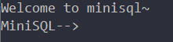

#### 4.2 表的建立与测试数据的插入

首先，我们建立表`student2`：

```mysql
create table student2(
	id int,
	name char(12) unique,
	score float,
	primary key(id)
);
```

然后插入10000条测试数据。由于数据量较大，我们使用`execfile`命令进行文件批处理：

```mysql
execfile student.txt;
```


脚本文件student.txt内容如下，包含嵌套调用：

```mysql
create table student2(
	id int,
	name char(12) unique,
	score float,
	primary key(id)
);

execfile instruction0.txt;
execfile instruction1.txt;
execfile instruction2.txt;
execfile instruction3.txt;
execfile instruction4.txt;
execfile instruction5.txt;
execfile instruction6.txt;
execfile instruction7.txt;
execfile instruction8.txt;
execfile instruction9.txt;
```

instruction0~instruction9.txt每个包含1000条插入记录，在此不具体展示。

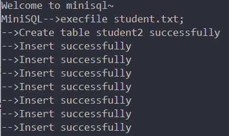

执行完毕后，文件目录下已经多了两个文件：

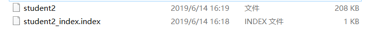

分别为表数据文件与主键`id`的索引文件。

#### 4.3 多条测试语句

1. 首先考察int类型上的等值条件查询

   ```mysql
   select * from student2 where id=1080100245;
   ```

   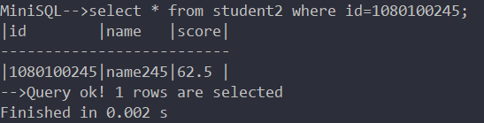

2. 考察float类型上的等值条件查询，观察数量

   ```mysql
   select * from student2 where score=98.5;
   ```

   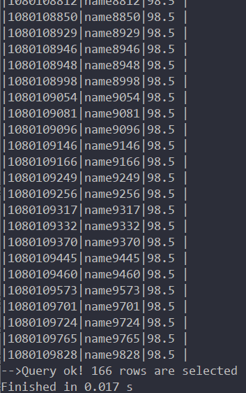

   数量为166

3. 考察char类型上的等值条件查询，此处需观察执行时间`t1`

   ```mysql
   select * from student2 where name='name245';
   ```

   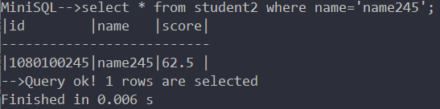

   记录：`t1`=0.006s

4. 考察int类型上的不等条件查询，观察数量

   ```mysql
   select * from student2 where id<>1080109998;
   ```

   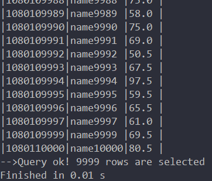

   数量为9999，符合预期

5. 考察float类型上的不等条件查询，观察数量

   ```mysql
   select * from student2 where score<>98.5;
   ```

   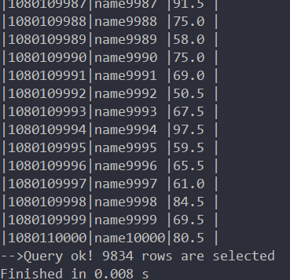

   数量为9834，与2中对比知，由于 $9834=10000-166$，符合预期

6. 考察char类型上的不等条件查询，观察数量

   ```mysql
   select * from student2 where name<>'name9998';
   ```

   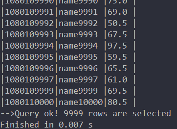

   数量为9999，由于name是unique key，因此符合预期

7. 考察多条件and查询，观察数量

   ```mysql
   select * from student2 where score>80 and score<85;
   ```

   

   可以看到，选取出来的数据score的确处于$(80,85)$之间

8. 考察多条件and查询，观察数量

   ```mysql
   select * from student2 where score>95 and id<=1080100100;
   ```

   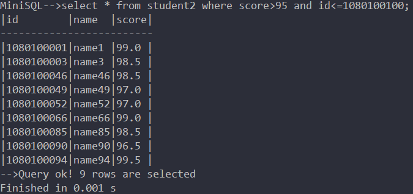

9. 考察unique key约束冲突

   ```mysql
   insert into student2 values(1080100245,'name245',100);
   ```

   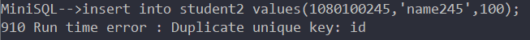

   由于表中已存在`id`=1080100245的数据，因此报错

10. 考察索引的建立

    * 考察非unique key建立索引的报错

      ```mysql
      create index stuidx on student2 ( score );
      ```

      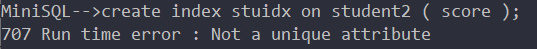

      由于unique key才能建立索引，因此报错

    * 在name这个unique属性上创建index

      ```mysql
      create index stuidx on student2 ( name );
      ```

      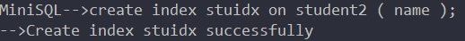

      

      目录中多了一个.index文件，索引创建成功

11. 此处需观察执行时间`t2`

    ```mysql
    select * from student2 where name='name245';
    ```

    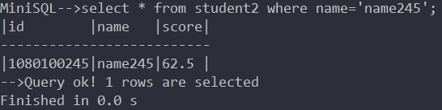

    建立索引后，`t2`=0.0s（*Java*系统时间最小精度1ms，即小于1ms），与建立索引前的`t1`=0.006s相比，速度提升明显

12. 考察在建立索引后再插入数据

    ```mysql
    insert into student2 values(1080197996,'name97996',100);
    ```

    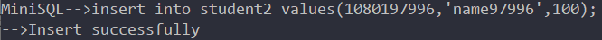

13. 考察是否插入成功，并需观察执行时间`t3`

    ```mysql
    select * from student2 where name='name97996';
    ```

    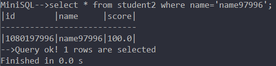

    插入成功，`t3`=0.0s

14. 考察delete

    ```mysql
    delete from student2 where name='name97996';
    ```

    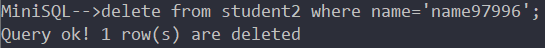

15. 考察是否删除成功

    ```mysql
    select from student2 where name='name97996';
    ```

    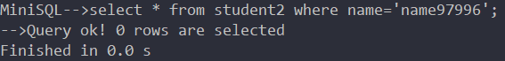

    可见，删除成功

16. 重新插入

    ```mysql
    insert into student2 values(1080197996,'name97996',100);
    ```

    

17. 考察drop index

    ```mysql
    drop index stuidx;
    ```

    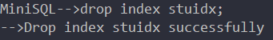

    提示删除成功，进入文件目录中发现.index文件已被删除

18. 需观察此处的执行时间`t4`

    ```mysql
    select * from student2 where name='name97996';
    ```

    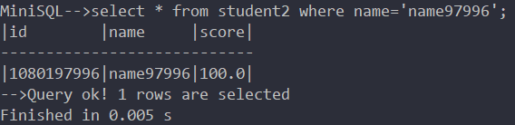

    与`t3`比较发现，删除索引后，查找速度的确明显变慢

19. 需观察此处的执行时间`t5`

    ```mysql
    select * from student2 where name='name245';
    ```

    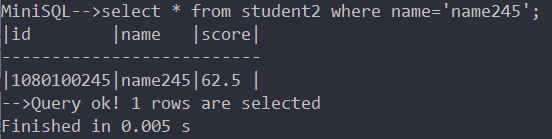

    与`t2`比较发现，删除索引后，查找速度的确明显变慢

20. 考察主键（有索引）delete

    ```mysql
    delete from student2 where id=1080100245;
    ```

    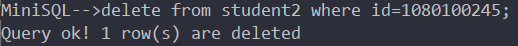

21. 考察是否删除成功

    ```mysql
    select * from student2 where id=1080100245;
    ```

    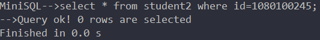

    可见，删除成功

22. 考察（无索引）delete

    ```mysql
    delete from student2 where score=98.5;
    ```

    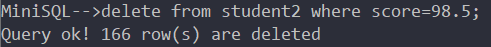

    与2中的数量（166）相等，符合预期

23. 考察是否删除成功

    ```mysql
    select * from student2 where score=98.5;
    ```

    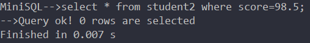

    可见，删除成功

24. 考察delete（所有元素）

    ```mysql
    delete from student2;
    ```

    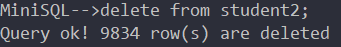

    $9834=10000-166$，数量符合预期

25. 考察是否删除成功

    ```mysql
    select * from student2;
    ```

    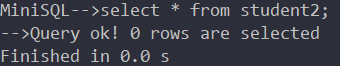

    可见，删除成功

26. 考察drop table

    ```mysql
    drop table student2;
    ```

    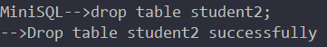

    进入文件目录，发现表数据文件student2与主键的索引文件student2_index.index均已删除

27. 考察drop table后再select是否报错

    ```mysql
    select * from student2;
    ```

    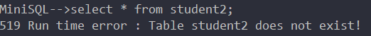

    表student2已不存在，因此select报错。

#### 4.4 程序结束

结束程序时，应输入语句`quit;`（而不是直接点击右上角的红叉），因为退出时会执行一些终止化操作，把*CatalogManager*、*IndexManager* 中的信息以及 *BufferManager* 中的缓存写回硬盘，直接点击红叉可能会导致下次程序启动时初始化错误。

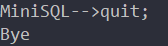

退出后，目录中多出了index_catalog, table_catalog两个文件：

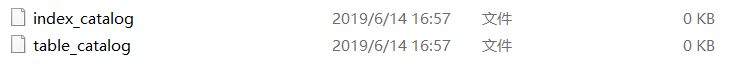

#### 4.5 结论

通过多条语句的测试，以及对一些select语句选取到的数量的观察可知，*MiniSQL*能够很好地完成指定的功能。而对于一些逻辑错误（如unique key重复插入、非unique key建索引等）也能及时检测并报错。而在索引的性能对比中，在有无索引情况下执行相同语句，有`t2`<`t1`, `t2`<`t5`和`t3`<`t4`，索引对性能的提升一目了然。


## 5 其他说明

#### 5.1 个人分工

| 姓名   | 分工          |
| ------ | ------------ |
| 应承峻 | 整体框架搭建<br>代码开发约定<br>BufferManager<br>API中大部分模块<br>Interpreter中Select和Delete的解析 |
| 朱璟森 | BPTree<br>IndexManager部分模块<br>API中Select模块<br>整体功能测试 |
| 沈韬立 | CatalogManager<br>IndexManager<br>API中Select模块<br>整体功能测试 |
| 余瑞璟 | RecordManager<br>Interpreter中大部分模块<br>整体功能测试 |

#### 5.2 项目Git地址
待验收结束后将开源项目地址： *https://github.com/ChenjunYing/Minisql*

#### 5.3 项目更新日志

| Date       | User    | Info                                                         |
| ---------- | ------- | ------------------------------------------------------------ |
| 2019-05-18 | ycj     | 新建项目框架，约定命名、注释规范                             |
| 2019-05-30 | ycj     | Buffer&BufferManager实现                                     |
| 2019-06-01 | yrj     | Address&FieldType&TableRow&Condition类实现                   |
| 2019-06-01 | ycj     | BufferManager类增加了make_invalid接口，修改了read_block_from_disk函数 |
| 2019-06-03 | stl     | CatalogManager&Attribute&Index&Table实现&Main test函数&Condition修改 |
| 2019-06-04 | yrj     | Condition&TableRow类修改，RecordManager实现，TestRecord测试程序上传 |
| 2019-06-05 | zjs     | B+树类BPTree实现                                             |
| 2019-06-06 | stl     | 修复enum语法错误，将部分print改为throw                       |
| 2019-06-06 | ycj     | 修改BufferManager中方法为static                              |
| 2019-06-06 | ycj     | 增加interpreter & API 文件                                   |
| 2019-06-06 | ycj     | 修改整体架构                                                 |
| 2019-06-07 | zjs     | BPTree修改：增加不等值查找                                   |
| 2019-06-07 | zjs stl | 增加IndexManager，修复BPTree                                 |
| 2019-06-07 | yrj     | 修改RecordManager，增加地址操作的条件参数                    |
| 2019-06-08 | ycj     | 修改BufferManager，初始化使用静态函数而不是使用构造函数      |
| 2019-06-08 | stl     | 修复API中table、index创建和删除的bug                         |
| 2019-06-08 | yrj     | 修改RecordManager和Condition，修正了CHAR类的读写方式         |
| 2019-06-08 | stl     | 完成API中的select函数                                        |
| 2019-06-09 | zjs     | 修改API中的select函数                                        |
| 2019-06-09 | zjs     | 修改API中的delete_row函数                                    |
| 2019-06-09 | stl     | 修改API中的drop_index参数为indexName                         |
| 2019-06-09 | ycj yrj | Interpreter模块实现                                          |
| 2019-06-10 | yrj     | 修改RecordManager中delete函数，删除对应索引                  |
| 2019-06-10 | ycj     | 优化查询输出，增加QException类                               |
| 2019-06-10 | yrj     | Interpreter模块增加异常处理                                  |
| 2019-06-11 | zjs     | Interpreter模块增加insert时的unique key重复判断              |
| 2019-06-11 | zjs     | Interpreter模块增加create_index时的unique key判断            |
| 2019-06-11 | stl     | 修改show_tables和show_indexes的输出                          |
| 2018-06-11 | yrj     | Interpreter模块异常处理优化，增加计时处理                    |
| 2019-06-12 | zjs     | Interpreter少量bug优化                                       |
| 2019-06-12 | ycj     | 优化delete/select的输出                                      |
| 2019-06-12 | zjs     | Interpreter优化输出，API修复bug，更改create_table异常抛出    |